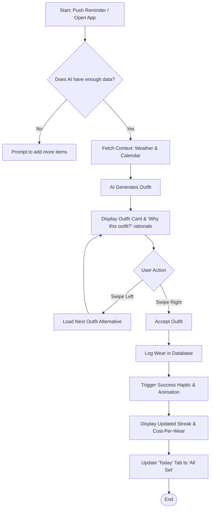
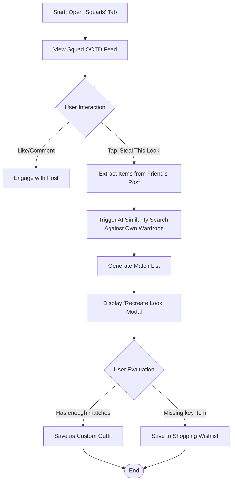

# UX Design Specification Vestiaire

**Author:** Yassine
**Date:** 2026-03-09

---

<!-- UX design content will be appended sequentially through collaborative workflow steps -->

## Executive Summary

### Project Vision

Vestiaire is an AI-powered wardrobe management platform that reduces clothing waste and decision fatigue. It uses a unified Gemini 2.0 Flash AI pipeline to handle everything from background removal and item categorization to context-aware outfit generation (based on weather and calendar events), shopping compatibility analysis, and sustainability tracking.

### Target Users

Fashion-conscious individuals aged 18–35 in the UK and France. Key personas include:
*   **The Daily Utility User:** People struggling with morning outfit decisions.
*   **The Digital Organizer:** Budget-conscious users building and tracking a digital wardrobe (e.g. tracking cost-per-wear).
*   **The Social Explorer:** Highly engaged social users managing "Style Squads" to share outfits.

### Key Design Challenges

*   **Frictionless Data Entry:** Uploading and categorizing clothing can be tedious; the AI extraction must feel magical and require minimal manual correction.
*   **Information Architecture:** Balancing daily utility (weather, today's outfit, quick logging) with deep wardrobe management and social features without cluttering the interface.
*   **Explainable AI:** Clearly communicating *why* an outfit or shopping score was suggested to build trust in the AI's intelligence.

### Design Opportunities

*   **The "Steal This Look" Interaction:** Creating a magical, seamless moment that bridges social inspiration with personal wardrobe utility.
*   **Sustainability as a Status Symbol:** Visualizing the "Eco Warrior" score and CO2 savings in a highly sharable, premium way that encourages positive behavior.

## Core User Experience

### Defining Experience

The core user experience revolves around the **Daily Outfit Decision & Wear Logging**. Users open the app each morning (or the night before) to discover what they should wear, based on a smart synthesis of current weather, their schedule, and their wardrobe data. The critical action is accepting the AI's suggestion and seamlessly logging it as worn.

### Platform Strategy

*   **Primary Platform:** Mobile App (iOS primary focus, Android supported via Flutter).
*   **Interaction Model:** Primarily touch-based (swiping/tapping). Outfit suggestions use a Tinder-like swipe interface (swipe right to accept/save, swipe left to see the next option).
*   **Offline Support:** Basic browsing of the digitized wardrobe must work offline using cached data. AI generation and image uploads require a network connection.
*   **MVP Shell:** The primary MVP navigation shell is `Home`, `Wardrobe`, `Add`, `Outfits`, and `Profile`. Social / Style Squads remains a growth feature and can be promoted to a primary destination after MVP by moving add-item capture to a floating action button.

### Effortless Interactions

*   **1-Tap Digitization:** Uploading a photo must automatically remove the background and pre-fill category, color, material, and pattern via Gemini with >85% accuracy.
*   **Zero-Friction Wear Logging:** Tapping "I wore this" directly from the daily suggestion widget on the Home screen.
*   **Passive Context Gathering:** Weather and calendar data are pulled automatically; the user doesn't need to manually input "It is raining" or "I have a formal meeting."

### Critical Success Moments

*   **The "Closet Safari" (First 7 Days):** The onboarding moment where a user successfully digitizes 20 items quickly and unlocks their first premium tier reward. If this feels like work, they churn.
*   **The "Aha!" Suggestion:** When the AI suggests an unexpected but perfect outfit combining an old neglected item with a newer piece, perfectly suited for that day's specific weather and calendar events.
*   **The First "Steal This Look" Match:** When a user sees a friend's outfit on the Style Squad feed and the app instantly finds 3 visually similar items in their own wardrobe.

### Experience Principles

1.  **Context Over Catalog:** Don't just show users what they own; show them what they should wear *right now*.
2.  **Magic, Not Manual:** Rely on AI for heavy lifting (categorization, background removal, outfit generation) to eliminate data entry friction.
3.  **Positive Reinforcement:** Focus on the joy of wearing clothes you own and saving money/carbon, rather than guilt about overconsumption.
4.  **Glanceable Intelligence:** "Why this outfit?" cards should explain the AI's logic in one clear, easily readable sentence.

## Desired Emotional Response

### Primary Emotional Goals

1.  **Relief & Clarity:** Removing the cognitive load of getting dressed in the morning. Users should feel that a daily chore has been solved for them.
2.  **Confidence:** Feeling put-together and knowing the outfit is appropriate for the weather, the day's events, and their personal style.
3.  **Positive Accomplishment ("Smug Satisfaction"):** Knowing they are maximizing their wardrobe ROI and reducing clothing waste without sacrificing style.

### Emotional Journey Mapping

*   **Discovery/Onboarding (The "Closet Safari"):** *Delight and Surprise.* "Wow, this AI actually knows my clothes. This is magic."
*   **Core Experience (Morning Outfit Check):** *Confidence and Relief.* "I look great and I didn't have to think about it. I'm ready for the day."
*   **Analytics/Sustainability Check (Monthly):** *Accomplishment and Pride.* "I'm actually wearing what I own, saving money, and helping the environment."
*   **Social/Style Squads (Ad-hoc):** *Connection and Inspiration.* "My friends look great, and I can recreate that look with my own clothes."

### Micro-Emotions

*   **Confidence vs. Confusion:** The AI *must* explain why it picked an outfit. Confusion breeds mistrust in the AI; clear explanations breed confidence.
*   **Accomplishment vs. Frustration:** Digitizing the wardrobe must feel like rapid accomplishment. If background removal fails or categorization is repeatedly wrong, the user will feel frustrated and abandon the setup.
*   **Joy vs. Guilt:** Sustainability features should focus on the joy of wearing clothes you own and the positive impact of your actions, rather than inducing guilt about past overconsumption.

### Design Implications

*   **Relief & Clarity** &rarr; The UI for the daily outfit suggestion must be uncluttered. Do not overwhelm the user with options immediately; present the *best* option clearly, with a simple swipe to see alternatives.
*   **Confidence** &rarr; Use high-quality visual presentations for outfits. The "Why this outfit?" text should use affirming, confident language.
*   **Delight & Surprise** &rarr; Implement micro-animations during the AI categorization phase to make the background removal and tagging process feel magical and fast.
*   **Accomplishment** &rarr; Use gamification (badges, streaks, progress bars) during onboarding and for wear-logging to reinforce the feeling of building a valuable personal database.

### Emotional Design Principles

*   **The UI must be the calm center of a chaotic morning.**
*   **AI should act like a supportive stylist, not a generic algorithm.**
*   **Reward every action that builds the user's wardrobe database.**

## UX Pattern Analysis & Inspiration

### Inspiring Products Analysis

*   **Tinder / Bumble (Swipe Mechanics):** The swipe interface is universally understood, decisive, and reduces the cognitive load of a complex decision to a simple gesture. This is perfect for the daily outfit suggestion.
*   **Vinted / Depop (Listing Flow):** They have perfected the "take a photo and list" flow to be as fast as possible. Vestiaire's wardrobe digitization needs to feel even faster and more magical than a Vinted listing.
*   **Duolingo / Apple Fitness (Gamification):** The streak and badge elements drive daily habit formation. The "Closet Safari" onboarding and daily wear-logging rely heavily on this interaction loop.
*   **Pinterest (Visual Browsing):** The visual grid and masonry layout are ideal for browsing the digitized wardrobe and Style Squad feeds, putting the focus entirely on the visual items rather than text.

### Transferable UX Patterns

**Navigation Patterns:**
*   Bottom tab bar for core MVP destinations (Home/Today, Wardrobe, Add, Outfits, Profile).
*   Swipe-to-dismiss for modal interactions to keep the user feeling grounded.

**Interaction Patterns:**
*   Swipe Right (Save/Accept) and Swipe Left (Discard/Next) for outfit suggestions.
*   "Pull to refresh" on the social feed.
*   Haptic feedback on successful actions (saving an outfit, reaching a streak).

**Visual Patterns:**
*   Large edge-to-edge photography in the social feed.
*   Clean, stark white/dark minimal backgrounds to let the varied colors of clothing stand out.
*   Circular progress rings (a la Apple Fitness) for sustainability scoring and closet utilization.

### Anti-Patterns to Avoid

*   **Forced Manual Entry:** Never force a user to type in a brand or color if the AI can guess it. Every text field is a drop-off point.
*   **Overwhelming Data Displays:** Analytics are great, but showing a spreadsheet of data on mobile is horrible. Data must be visualized simply.

### Design Inspiration Strategy

**What to Adopt:**
*   The dating app swipe mechanic for outfit discovery.
*   The fitness app progress ring visualization for wardrobe utilization.

**What to Adapt:**
*   The resale marketplace upload flow: adapter to be faster by removing the need for pricing and shipping details.

**What to Avoid:**
*   Complex hierarchical folder structures for organizing clothes. Use a flat tag/filter system instead.

## Design System Foundation

### Design System Choice

**Flutter Material 3 (Heavily Customized / iOS-Leaning Hybrid)**

### Rationale for Selection

1.  **Development Velocity:** As a solo developer using Flutter, leveraging the built-in Material 3 package provides immediate access to stable, accessible, and performant widgets. Building a custom system from scratch would derail the MVP timeline.
2.  **Platform Alignment:** While Flutter defaults to Material (Android-feeling) widgets, the primary target market is iOS. A heavily customized theme allows us to use Material's robust engineering while softening the visual language to feel premium and native on an iPhone.
3.  **Thematic Flexibility:** Flutter's `ThemeData` is powerful enough to strip away the "stock Google" look and enforce the bespoke typography, stark contrast, and subtle border radiuses required for a fashion app.

### Chosen Direction

**Direction 2: Vibrant Soft-UI**

### Design Rationale

This direction was chosen because it strikes the perfect balance between the high-end editorial feel of the fashion domain and the approachable, friendly UI required for a daily utility app. The soft depth (neumorphism-lite) card style makes the UI feel tactile, while the strong Electric Blue accent color clearly draws the eye to primary actions (swiping, logging) and gamification elements (streaks, matching scores).

### Implementation Approach

*   **Flutter Foundation:** We will start with standard Material 3 components but globally apply a custom `ThemeData`.
*   **Shadows & Depth:** We will override standard Material elevation with custom, softer, slightly colored drop shadows to achieve the "Soft-UI" look without the full complexity of strict neumorphism.
*   **Color Palette:**
    *   `background`: #F3F4F6 (Very Light Gray)
    *   `surface`: #FFFFFF (White)
    *   `primary`: #4F46E5 (Electric Blue)
    *   `secondary`: #E0E7FF (Light Blue Tint for backgrounds of primary text)
    *   `onBackground`: #1F2937 (Dark Slate)

### Customization Strategy

*   **Typography:** Replace default Roboto with a premium sans-serif (e.g., Inter, SF Pro, or a geometric font like Outfit).
*   **Color Role Redefinition:** Move away from Material's vibrant primary/secondary colors. Use a stark monochromatic base (black, white, grays) to let the clothing photography provide the color. Reserve one vibrant accent color strictly for primary actions and gamification achievements.
*   **Shape:** Override default heavy shadows and pill shapes. Favor subtle depth (or flat design with borders) and refined border radii.

## User Journey Flows

### 1. The Morning Outfit Decision (Daily Loop)

This is the core repeating loop of the application. It must be frictionless and fast.



### 2. The "Closet Safari" (Onboarding/Digitization)

This flow is the biggest friction point for new users. If the AI background removal and categorization fail here, the user churns.

```mermaid
graph TD
    A[Start: Taps 'Add Item'] --> B{Input Method};
    B -- Bulk Import --> C[Select Multiple Photos from Gallery];
    B -- Single Photo --> D[Take Photo / Select Gallery];
    D --> E[Upload to Cloud Storage];
    C --> E;
    E --> F[Trigger Gemini Vision API];
    F --> G[Remove Background];
    G --> H[Categorize: Type, Color, Material, Pattern];
    H --> I[Display Results to User];
    I --> J{User Review};
    J -- Edit Needed --> K[User Manually Corrects Bad Tags];
    K --> L;
    J -- Looks Good --> L[Save Item(s) to Wardrobe];
    L --> M[Calculate Wardrobe Stats / Update Challenge Progress];
    M --> N([End]);
```

### 3. The Style Squad Social Experience

This flow drives social engagement and turns single-player wardrobe management into a multiplayer inspiration engine.



### Journey Patterns

*   **The Swipe Paradigm:** Used primarily for the daily outfit loop, turning a complex decision into a binary choice.
*   **AI-First Input:** In the upload flow, the AI always attempts to populate the data first. The user is an editor, not a data-entry clerk.
*   **Positive Reinforcement Loops:** Every major journey ends with a quantifiable positive feedback metric (e.g., lower cost-per-wear, streak increase).

### Flow Optimization Principles

1.  **Zero-State Avoidance:** The home screen should never be blank. If no outfit is generated, it should explain why and provide a clear one-tap action to fix it (e.g., "Add 3 more items to get suggestions").
2.  **Optimistic UI:** When the user swipes right to log an outfit, trigger the success animation immediately on the client side while the database update happens asynchronously in the background.

### Implementation Approach

*   Start with a baseline `MaterialApp` using `ThemeData` to globally override core aesthetics.
*   Prioritize iOS design sensibilities for navigation (Cupertino bottom tabs, swipe back) even while using Material components under the hood, unless building a specific Android version.
*   Build a small library of app-specific wrapper widgets (e.g., `VestiaireButton`, `VestiaireCard`) that encapsulate the complex styling over the base Flutter widgets.

## Component Strategy

### Color System

Since there are no strict existing brand guidelines, we will use a **Sophisticated Monochromatic Base + Single Accent** approach:
*   **Backgrounds:** Stark white (#FFFFFF) and soft off-whites for the MVP light-mode experience.
*   **Surfaces:** Off-whites (e.g., #F5F5F5) or subtle dark grays (#1E1E1E) for cards and grouped content.
*   **Text:** High-contrast black (#111111) and dark grays (#666666) for hierarchy.
*   **Accent Color:** A vibrant, energetic accent color used *sparingly* for primary buttons, streak flames, and positive feedback. (e.g., Electric Blue #2563EB or a vibrant Neon Green #10B981).

### Typography System

*   **Primary Typeface (UI & Body):** `Inter` or `SF Pro` (system default on iOS). Highly legible at small sizes, clean, and invisible.
*   **Secondary Typeface (Display & Headers):** A more stylized geometric sans-serif (like `Outfit` or `Plus Jakarta Sans`) for large numbers (temperature), primary headers, and the "Why this outfit?" title to give it an editorial fashion magazine feel.
*   **Hierarchy:** Strict adherence to a typographic scale, prioritizing high contrast between titles and body copy to ensure glanceability in the morning.

### Spacing & Layout Foundation

*   **Grid System:** Base-8 grid system (margins/padding in multiples of 8px).
*   **Density:** Airy and spacious. Clothing photography can be chaotic; the UI must provide breathing room.
*   **Edge-to-Edge:** Use edge-to-edge imagery for outfits and wardrobe items where possible to maximize the visual impact of the clothing.
*   **Containment:** Use whitespace rather than borders or heavy drop shadows to separate elements.

### Accessibility Considerations

*   **Contrast Ratios:** Ensure all text passes WCAG AA standards (4.5:1 minimum contrast ratio).
*   **Touch Targets:** Ensure all tappable areas (especially swipe targets and small buttons) are at least 44x44px.
*   **Dark Mode:** Deferred post-MVP. The MVP experience is light mode only and must achieve strong contrast without relying on a dark theme.

## Core User Experience Mechanics

### Defining Experience

The defining experience of Vestiaire is **The Daily Outfit Acceptance Loop**. This is the core interaction that users will perform every single morning. If this loop is fast, accurate, and delightfully presented, users will build a habit and stick with the app long-term.

### User Mental Model

*   **Current Solution:** Users stare at their closet, check the weather app on their phone, remember what they wore yesterday, and try to synthesize an outfit in their head under time pressure.
*   **Vestiaire's Model:** The app acts as an omniscient stylist who has already done the calculus of weather + calendar + wear history + inventory before the user even opens their eyes. The user's role shifts from *creator* to *editor*.

### Success Criteria

1.  **Speed to Value:** It must take less than 5 seconds from opening the app to visually understanding the outfit suggestion and its rationale.
2.  **Zero-Typing Interaction:** The user should only need to swipe (Tinder-style) to accept or reject the outfit.
3.  **Instant Reward:** Accepting an outfit instantly provides a hit of dopamine via micro-animations (e.g., streak extension, cost-per-wear reduction notification).

### Novel UX Patterns

*   **Glanceable AI Rationale:** While Tinder uses swiping for photos, we are pairing the swipe gesture with an AI explanation card ("Why this outfit?"). This is a novel combination of established fast-sorting UX (swiping) with transparent AI communication.

### Experience Mechanics

**1. Initiation (The Trigger):**
*   The user receives a rich push notification at their preferred wake-up time: "Good morning! 14°C and rain today. I've prepared a water-resistant outfit for your Client Lunch."
*   A dedicated iOS Home Screen Widget is deferred post-MVP and is not required for the initial implementation scope.

**2. Interaction (The Evaluation):**
*   The user opens the app directly to the "Today" tab.
*   A large, edge-to-edge card displays the outfit components visually.
*   The user reads the short "Why this outfit?" sentence.
*   **Action:** Swipe Right (Accept & Log) or Swipe Left (Discard & view alternative).

**3. Feedback (The Reward):**
*   On Swipe Right: Strong haptic feedback (success vibration). The card flies off-screen with a satisfying animation.
*   A brief toast/overlay appears: "Logged! Blazer cost-per-wear dropped to £18. 12-Day Streak! 🔥"

**4. Completion:**
*   The "Today" tab updates to a "You're all set" state, showing the logged outfit for reference. No further action is required until tomorrow.

## Component Strategy

### Design System Components

Based on our choice of **Flutter Material 3 (Heavily Customized)**, we will leverage the following out-of-the-box components:
*   **Navigation:** `NavigationBar` (bottom tabs), `AppBar` (top headers), `Drawer` (if needed, though bottom sheets are preferred for iOS feel).
*   **Inputs:** `TextField` (with custom minimal decoration), `Switch`, `Slider`.
*   **Layout:** `ListView`, `GridView` (for wardrobe/squad layouts).
*   **Action:** `FloatingActionButton` (for the primary "Add Item" camera action).
*   **Feedback:** `SnackBar` (for quick success toasts like "Item Saved").

### Custom Components

Looking at our core journeys and "Soft-UI" design direction, we need to design several bespoke components not provided out-of-the-box:

#### 1. The Daily Outfit Swipe Card

**Purpose:** The primary interaction surface for viewing and deciding on the daily outfit.
**Anatomy:** A large, almost edge-to-edge container featuring high-quality composed imagery of the outfit, overlaid with the "Why this outfit?" AI rationale text block, and subtle swipe affordance indicators (arrows or icons).
**States:** Default (centered), Swiping Right (overlay turns green/shows 'Wear'), Swiping Left (overlay turns red/shows 'Skip'), Loading (shimmer effect while AI generates).
**Interaction:** Draggable horizontally. Releases trigger actions based on threshold distance.

#### 2. The Context Header (Weather & Event)

**Purpose:** To immediately ground the user in *why* an outfit is being suggested before they even look at the clothes.
**Anatomy:** A prominent, stylized header component. Shows the current temperature (large typography), a weather icon, and the primary calendar event for the day (e.g., "14°C Rain • Client Lunch").
**Variants:** Minimal (just weather if no events), Expanded (showing full day timeline on tap).

#### 3. The "Closet Safari" Item Upload Card

**Purpose:** To make reviewing AI-extracted metadata fast and frictionless.
**Anatomy:** A split-view card. Top/Left: The image with the background removed. Bottom/Right: A dense grid of chips (tags) representing Category, Color, Material, etc.
**Interaction:** Tapping a chip opens a bottom sheet to quickly change the value. A prominent primary button to confirm and save.

#### 4. The Sustainability / Streak Ring

**Purpose:** Gamification and positive reinforcement.
**Anatomy:** A circular progress indicator (similar to Apple Fitness rings) that fills up based on wardrobe utilization or streak days. Often contains a large number or flame icon in the center.
**Variants:** Small (inline in lists), Large (hero placement on profile/analytics tab).

### Component Implementation Strategy

1.  **Wrapper Architecture:** We will create wrapper classes (e.g., `VestiaireCard`, `VestiairePrimaryButton`) rather than using base Flutter widgets directly throughout the app. This ensures our custom "Soft-UI" styling (specific border radii, tailored shadows) is applied universally and easily updatable.
2.  **Stateless First:** Custom components should be built as stateless "dumb" visual representations that receive data and callbacks, keeping business logic strictly separated in state management (e.g., Riverpod/Bloc).

### Implementation Roadmap

*   **Phase 1 (Core Engine):** The Daily Outfit Swipe Card, Context Header, primary `VestiaireButton`, and basic `VestiaireCard`. These are required for the MVP daily loop.
*   **Phase 2 (Growth & Onboarding):** The "Closet Safari" Item Upload Card (dense chip layouts), loading shimmers, and the Sustainability/Streak Rings.
*   **Phase 3 (Social):** OOTD feed cards featuring the "Steal This Look" button and reaction clusters.

## UX Consistency Patterns

### Button Hierarchy

**1. Primary Action (`VestiairePrimaryButton`)**
*   **When to Use:** The single most important action on a screen (e.g., "Save Outfit", "Add Item", "Checkout").
*   **Visual Design:** Solid fill using the primary Accent Color (Electric Blue #4F46E5). White, bold typography (`Inter`). Fully rounded (pill shape) or soft-rounded rectangle.
*   **Behavior:** Elevates slightly on tap. Shows an inline loading spinner when awaiting a network response (e.g., waiting for AI).

**2. Secondary/Tertiary Actions (`VestiaireSecondaryButton`)**
*   **When to Use:** Alternative options or cancel actions.
*   **Visual Design:** Clear background with a border, or a very light tinted background (e.g., #E0E7FF) with Electric Blue text.
*   **Behavior:** Immediate response; rarely triggers loading states on its own.

### Feedback Patterns

**1. Positive Reinforcement (The "Streak" Pattern)**
*   **When to Use:** When a user completes a core loop successfully (logging an outfit, uploading an item).
*   **Visual Design:** Haptic vibration + floating snackbar overlay at the bottom of the screen. Incorporates clean, bespoke SVG iconography (e.g., a custom flame icon for streaks or a sparkle icon for AI), avoiding native OS emojis to maintain a premium feel.
*   **Behavior:** Non-blocking. Disappears after 3 seconds or on next user interaction.

**2. Error Recovery (The "AI Hiccup" Pattern)**
*   **When to Use:** When the AI miscategorizes an item or fails to remove a background.
*   **Visual Design:** Clear, non-judgmental inline error messaging ("Hmm, that didn't quite work. Try editing manually.")
*   **Behavior:** Always provide a manual fallback immediately. Never dead-end the user on an AI failure.

**3. Loading States (The "Thinking" Pattern)**
*   **When to Use:** When waiting for the Gemini API (outfit generation, background removal).
*   **Visual Design:** Shimmering skeleton screens that match the shape of the expected content, rather than generic spinner wheels. For outfits, show the silhouette of a card loading.

### Form Patterns

**1. AI-Assisted Editing (The "Tag Cloud" Pattern)**
*   **When to Use:** Editing item metadata (Category, Color, Material) after an AI scan.
*   **Visual Design:** A dense cluster of selectable chips.
*   **Behavior:** The AI pre-selects chips. Tapping a pre-selected chip opens a tightly scoped bottom sheet to change it, rather than navigating to a full new screen. Avoid free-text typing wherever possible.

### Navigation Patterns

**1. Core Navigation (Bottom Tab Bar)**
*   **When to Use:** Switching between top-level MVP destinations (Home, Wardrobe, Add, Outfits, Profile).
*   **Visual Design:** iOS-style translucent blur background with high-contrast active icons and muted inactive icons.
*   **Behavior:** Preserves the back-stack state of each tab when switching between them.

**2. Contextual Deep Dives (Bottom Sheets)**
*   **When to Use:** Acting on a specific item (editing a piece of clothing, viewing event details).
*   **Visual Design:** A card that slides up from the bottom, covering 50-90% of the screen, with a visible drag handle at the top.
*   **Behavior:** Swipe down to dismiss. Keeps the context of the parent screen visible in the background (dimmed).

## Responsive Design & Accessibility

### Responsive Strategy

Vestiaire is fundamentally a mobile-first application designed for quick, one-handed interactions (e.g., swiping outfits during a morning commute). However, because it is built in Flutter, the codebase inherently supports larger screens.

*   **Mobile (Primary Focus):** Optimized for portrait orientation. Relies on bottom navigation, thumb-reachable primary actions, and vertical scrolling feeds.
*   **Tablet (Secondary Focus):** The application will function on iPads and Android tablets by scaling the portrait-first mobile UI. For complex views like the Wardrobe grid, we will utilize the extra width by increasing the number of grid columns (e.g., 2 columns on phone &rarr; 4+ columns on tablet) rather than stretching images uncomfortably.
*   **Desktop/Web (Future Consideration):** Not included in the MVP scope.

### Breakpoint Strategy

We will use standard Flutter breakpoints to trigger layout changes, focusing entirely on adapting the grid density of the wardrobe and social feeds within a portrait-first layout system.

*   **Compact (Mobile):** `0px - 599px`. Bottom navigation bar. Wardrobe grid is 2 items wide. 
*   **Medium (Tablet Portrait):** `600px - 839px`. Wardrobe grid expands to 3-4 items wide. Bottom navigation bar persists.
*   **Expanded (Large Portrait / Wide Device):** `840px+`. Maximum width constraints are applied to the central daily swipe card to prevent absurdly large images. Wardrobe grid expands to 5+ items wide.

*Note: The MVP application remains portrait only. Larger devices use expanded portrait layouts rather than a separate rotation-specific experience.*

### Accessibility Strategy

Vestiaire aims for **WCAG AA Compliance** as an industry standard for good UX, with a special focus on visual clarity given the fashion context.

**Key Accessibility Considerations:**
*   **Color Contrast:** Extreme care must be taken with text overlaid on clothing photography. We will implement gradient scrims (darkening/lightening overlays) behind text on images to ensure contrast ratios meet or exceed 4.5:1.
*   **Touch Targets:** All interactive elements, especially the chips in the AI "Tag Cloud" and the navigation icons, must be at least 44x44 points.
*   **Screen Reader Support (Semantics):** Flutter's `Semantics` widget must be used aggressively. AI-generated descriptions of clothing items (e.g., "Navy blue cotton blazer") will double as `semanticLabels` for screen readers, making the visual wardrobe accessible to low-vision users.
*   **System Text Scaling:** The UI must handle `textScaleFactor` up to 200% gracefully without breaking the layout. 

### Testing Strategy

*   **Responsive Validation:** Test on physical iOS devices (iPhone SE size up to Pro Max size) to ensure the Daily Outfit card looks proportional and swipe gestures aren't impeded by screen edges.
*   **Accessibility Validation (Automated):** Use Flutter's `AccessibilityGuidelines` checker during automated widget testing.
*   **Accessibility Validation (Manual):** Navigate the core loop (Today tab &rarr; Swipe &rarr; Log) using iOS VoiceOver exclusively to ensure the `semanticLabels` provide enough context to make a dressing decision without sight.

### Implementation Guidelines

*   **Responsive:** Use `LayoutBuilder` and `MediaQuery` to determine grid column counts dynamically based on screen width, rather than hardcoding column numbers.
*   **Accessibility:** Wrap critical image-heavy widgets (like the Daily Outfit Card) in `Semantics(label: ..., child: ...)` to explicitly define what the screen reader should announce, avoiding default generic "Image" announcements.
*   **Safe Areas:** Strictly respect iOS and Android Safe Areas (notches, dynamic islands, home indicator bars) using the `SafeArea` widget to prevent critical content from being obscured.
